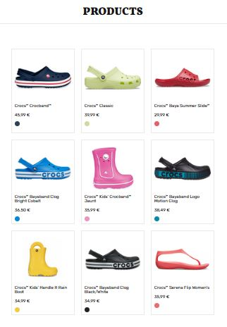

# React — Dynamic Component

Responsive react dynamic component implementation.

An application that dynamically creates product card components based on data from JSON.


## App View

The view of the application in the browser: 

 [Click here to see live view.](https://leventportfolio.netlify.app/liveviews/react-dynamic-component/)


## Component Structure

```console

   public/
   └── images/
   ...
   src/
   ├── components/
   │   ├── css/
   │   │   ├── header.css
   │   │   ├── productItem.css
   │   │   └── productsContainer.css
   │   ├── Header.jsx
   │   ├── ProductItem.jsx
   │   └── ProductsContainer.jsx
   ├── App.css
   ├── App.jsx
   ├── index.css
   └── main.jsx
   ...
   index.html
   
```

## How to

- ``` npm install ```
- ``` npm run dev ```
